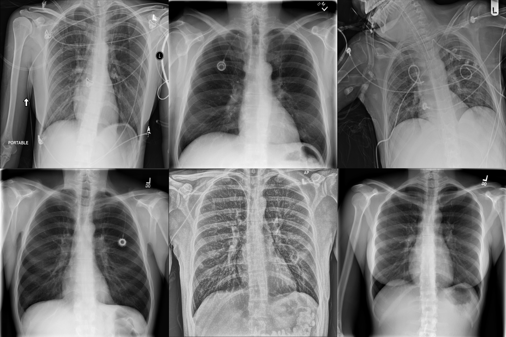

# COVID-19-Xray-Classifier

## Outline:
* Introduction:
* Motivation:
* Dataset
* Data Augmentation
* Model
* Training
* Results
* Running the code
* References

## Introduction:
Coronavirus disease 2019 (COVID-19) is an infectious disease caused by severe acute respiratory syndrome coronavirus 2 (SARS-CoV-2). The disease was first identified in December 2019 in Wuhan, the capital of China's Hubei province, and has since spread globally, resulting in the ongoing 2019–20 coronavirus pandemic. The first confirmed case of what was then an unknown coronavirus was traced back to November 2019 in Hubei.

## Motivation:
Predicting if a patient is infected with COVID-19 using an Xray scan is very useful during this pandemic, as there is a high demand on test kits, meanwhile x-ray machines are available to be used.

## Dataset:
The dataset is a combination of two sets, one that includes 30 thousand x-ray images which were part of a Kaggle competition (RSNA Penrumonia detection). The other set is a GitHub dataset that includes around 300 images, 155 of which were from COVID-19 infected patients. The data were combined and divided into three sections, normal cases, phenomena cases, and COVID-19 patients with there respective count 8800, 9500, and 155. Phenomena cases include all infections except COVID-19

## Data Augmentation:
Due to the low number of images available especially for COVID-19, data augmentation was necessary. The settings were very slight to not affect the original image, with a max rotation angle of 15, a zoom of 0.1, and a brightness change of 0.2. We were able to increase the COVID-19 cases 30 times and for the remaining classes two times only to maintain a balance. We ended with  19600, 19100, 3450

## Model:
The model is based on ResNet50 which is a very efficient and reasonably small convolutional neural network which is a good starting point for a set of very similar images. ResNet also includes skip connections, and ResNet was initialized using imagenet wights. The top layer of the ResNet was replaced with maxpooling, global average pooling, three dense layers, and three dropout layers.

## Training:
The model was trained with a batch size of 32, an input image size of 128x128 using adam optimizer, and a categorical crossentropy loss function. The training was done in two stages, the first stage was to train the top layers with an epoch of 2. and the second stage was to train the whole network with an epoch of 10.

## Results:
After training the model with 0.1 split, the accuracy result for the training is 90%, and for the test is 90%. The categorical crossentropy loss for the training is 0.26, and the test is 0.26.

## Running the code:
1. Copy the latest dataset from the Github link and Kaggle
2. Run the combine_datasets.ipynb to create the combined dataset
3. Run the train.ipynb to train the model.
  - The trained model is also available for download: https://drive.google.com/open?id=1pyGZQMSn_OUxoJLErkth4Hbhy2nxLtrc
4. Use the model to predict new cases.

## References:
- https://www.kaggle.com/c/rsna-pneumonia-detection-challenge
- https://github.com/ieee8023/covid-chestxray-dataset
- https://github.com/lindawangg/COVID-Net
- https://arxiv.org/ftp/arxiv/papers/2003/2003.14395.pdf

Note: This project is part of a Machine learning course taught by Dr.Davor Svetinovic
